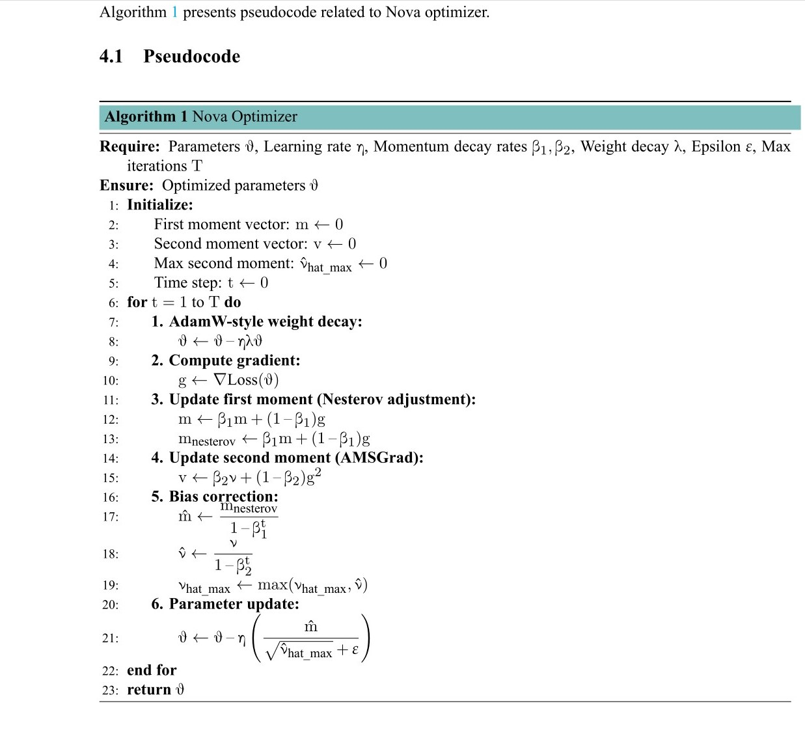
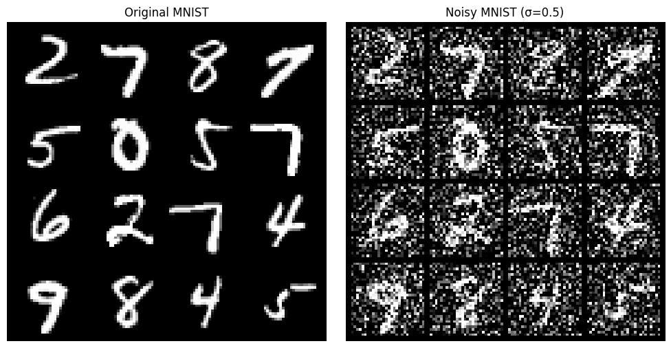

# Nova-Optimizer
 The choice of optimization algorithm significantly impacts deep learning model performance, affecting convergence speed, generalization, and training stability. Existing optimizers, such as Adam, AMSGrad, and AdamW, face significant limitations that hinder their effectiveness across diverse deep learning tasks and architectures. These include suboptimal momentum utilization, stalled training due to vanishing learning rates, and compromised generalization with weight decay. To address these critical challenges, we propose Nova, a novel hybrid optimizer that synergistically integrates Nesterov momentum, AMSGrad’s non-decreasing second moment estimate, and decoupled weight decay. Nova introduces a pioneering integration of established techniques, distinguishing it from prior optimizers. Beyond its core components, Nova incorporates adaptive gradient scaling to handle sparse and imbalanced data efficiently and a hybrid learning rate adjustment to reduce hyperparameter sensitivity. This combination enhances training dynamics, stability, and robustness across various deep learning tasks. Experimental results on benchmark datasets, such as CIFAR-10, MNIST, SST-2, and noisy MNIST, demonstrate Nova’s superior performance. For instance, Nova achieves a test accuracy of 90.01\% on CIFAR-10, significantly outperforming Adam’s 83.14\% and Nadam’s 80.85\%. On the SST-2 dataset, Nova achieves a test accuracy of 82.00\%, surpassing Adam's 66.28\% and AdamW's 81.65\%. Furthermore, Nova demonstrates robustness to noisy data, achieving a test accuracy of 96.58\% on noisy MNIST. These results show that Nova effectively overcomes the challenges of slow convergence, poor generalization, and sensitivity to data characteristics faced by existing optimizers. Nova’s exceptional performance across diverse benchmark datasets suggests its significant potential for broader applications in deep learning. By addressing the critical limitations of existing optimizers through a novel and synergistic combination of techniques, Nova represents a significant advancement in deep learning optimization, offering a powerful and robust solution that enhances training efficiency, model generalization, and stability. 

## Nova Optimizer Algorithm

**Inputs:**  
- Parameters: θ  
- Learning rate: η  
- Momentum decay rates: β₁, β₂  
- Weight decay: λ  
- Epsilon: ε  
- Max iterations: T  

**Initialize:**  
- First moment vector: m ← 0  
- Second moment vector: v ← 0  
- Max second moment: ν_hat_max ← 0  
- Time step: t ← 0  

**For** t = 1 to T **do**  
  1. Apply AdamW-style weight decay:  
     θ ← θ − ηλθ  
  2. Compute gradient:  
     g ← ∇Loss(θ)  
  3. Update first moment with Nesterov adjustment:  
     m ← β₁m + (1−β₁)g  
     m_nesterov ← β₁m + (1−β₁)g  
  4. Update second moment (AMSGrad):  
     v ← β₂v + (1−β₂)g²  
  5. Bias correction:  
     m̂ ← m_nesterov / (1−β₁ᵗ)  
     ν̂ ← v / (1−β₂ᵗ)  
     ν_hat_max ← max(ν_hat_max, ν̂)  
  6. Update parameters:  
     θ ← θ − η (m̂ / (√ν_hat_max + ε))  
     
**Return:** θ

---

### Performance Metrics on CIFAR-10

| Optimizer | Train Loss | Train Acc (%) | Val Loss | Val Acc (%) | Test Loss | Test Acc (%) | Epoch Time (s) |
|-----------|------------|---------------|----------|-------------|-----------|--------------|----------------|
| Nova      | 0.1550     | 94.70         | 0.3180   | 89.42       | 0.3345    | 90.01        | 41.95          |
| Adam      | 0.4788     | 84.94         | 0.5094   | 83.08       | 0.5069    | 83.14        | 39.99          |
| RMSprop   | 1.1128     | 59.39         | 1.0714   | 60.36       | 1.0597    | 61.01        | 38.50          |
| SGD       | 1.2252     | 55.11         | 1.1721   | 57.88       | 1.1325    | 58.57        | 39.87          |
| Nadam     | 0.5583     | 82.09         | 0.5642   | 81.20       | 0.5718    | 80.85        | 40.21          |

---

### Classification Metrics on CIFAR-10

| Optimizer | Precision (%) | Recall (%) | F1-score (%) |
|-----------|---------------|------------|--------------|
| Nova      | 89.98         | 90.01      | 89.99        |
| Adam      | 83.21         | 83.14      | 83.00        |
| RMSprop   | 61.01         | 61.01      | 59.77        |
| SGD       | 58.89         | 58.57      | 58.18        |
| Nadam     | 80.93         | 80.85      | 80.82        |

---

### Performance Metrics on MNIST

| Optimizer | Train Loss | Train Acc (%) | Val Loss | Val Acc (%) | Test Loss | Test Acc (%) | Epoch Time (s) |
|-----------|------------|---------------|----------|-------------|-----------|--------------|----------------|
| Nova      | 0.0204     | 99.33         | 0.0370   | 98.86       | 0.0295    | 98.95        | 12.01          |
| Adam      | 0.0673     | 98.20         | 0.0578   | 98.10       | 0.0504    | 98.58        | 11.22          |
| RMSprop   | 0.0699     | 98.08         | 0.0631   | 97.94       | 0.0514    | 98.50        | 11.21          |
| SGD       | 0.1240     | 96.45         | 0.0960   | 97.12       | 0.0855    | 97.51        | 11.16          |
| Nadam     | 0.0661     | 98.21         | 0.0582   | 98.16       | 0.0484    | 98.66        | 11.34          |

---

### Classification Metrics on MNIST

| Optimizer | Precision (%) | Recall (%) | F1-score (%) |
|-----------|---------------|------------|--------------|
| Nova      | 98.95         | 98.94      | 98.94        |
| Adam      | 98.58         | 98.57      | 98.57        |
| RMSprop   | 98.50         | 98.48      | 98.49        |
| SGD       | 97.52         | 97.49      | 97.50        |
| Nadam     | 98.67         | 98.65      | 98.66        |

---

### Performance Metrics for SST-2

| Optimizer | Test Loss | Test Acc (%) | Precision (%) | Recall (%) | F1-score (%) | Epoch Time (s) |
|-----------|-----------|--------------|---------------|------------|--------------|----------------|
| Nova      | 0.5125    | 82.00        | 82.00         | 82.01      | 81.99        | 15.48          |
| Adam      | 0.6397    | 66.28        | 68.71         | 65.94      | 64.85        | 15.31          |
| AdamW     | 0.5804    | 81.65        | 81.69         | 81.62      | 81.63        | 15.28          |
| RMS       | 0.6422    | 65.94        | 69.05         | 65.55      | 64.15        | 15.23          |
| SGD       | 0.6810    | 54.47        | 56.64         | 53.88      | 48.85        | 15.08          |
| Nadam     | 0.6399    | 66.17        | 68.84         | 65.81      | 64.61        | 15.36          |

---

### Classification Metrics on SST-2

| Optimizer | Precision (%) | Recall (%) | F1-score (%) |
|-----------|---------------|------------|--------------|
| Nova      | 82.11         | 82.12      | 82.11        |
| Adam      | 69.56         | 66.38      | 65.19        |
| AdamW     | 80.93         | 80.39      | 80.39        |
| RMS       | 68.10         | 65.48      | 64.41        |
| SGD       | 59.31         | 53.28      | 44.63        |
| Nadam     | 69.62         | 66.13      | 64.81        |

---

### Performance Metrics for Noisy MNIST

| Optimizer | Test Loss | Test Acc (%) | Precision (%) | Recall (%) | F1-score (%) | Epoch Time (s) |
|-----------|-----------|--------------|---------------|------------|--------------|----------------|
| Nova      | 0.1065    | 96.58        | 96.56         | 96.56      | 96.56        | 8.47           |
| AdamW     | 0.1112    | 96.14        | 96.14         | 96.11      | 96.12        | 7.85           |
| Adam      | 0.1156    | 96.17        | 96.16         | 96.15      | 96.14        | 7.77           |
| RMS       | 0.1072    | 96.53        | 96.52         | 96.50      | 96.50        | 7.75           |
| SGD       | 0.2727    | 91.32        | 91.24         | 91.21      | 91.20        | 7.70           |
| Nadam     | 0.1052    | 96.43        | 96.42         | 96.39      | 96.40        | 7.63           |

---

### Performance of Nova Optimizer Hyperparameter Combinations on MNIST

| Combination | LR    | $\beta_1$ | $\beta_2$ | WD    | Test Acc (%) | Precision (%) | Recall (%) | F1-score (%) |
|-------------|-------|-----------|-----------|-------|--------------|---------------|------------|--------------|
| Comb1       | 0.001 | 0.9       | 0.999     | 0.01  | 99.21        | 99.21         | 99.20      | 99.20        |
| Comb2       | 0.001 | 0.9       | 0.99      | 0.01  | 99.17        | 99.16         | 99.16      | 99.16        |
| Comb3       | 0.001 | 0.95      | 0.999     | 0.001 | 99.11        | 99.11         | 99.10      | 99.11        |
| Comb4       | 0.001 | 0.95      | 0.99      | 0.001 | 98.94        | 98.94         | 98.93      | 98.93        |
| Comb5       | 0.01  | 0.9       | 0.999     | 0.01  | 99.14        | 99.14         | 99.13      | 99.13        |
| Comb6       | 0.01  | 0.9       | 0.99      | 0.01  | 99.01        | 99.01         | 98.99      | 99.00        |
| Comb7       | 0.01  | 0.95      | 0.999     | 0.001 | 98.44        | 98.44         | 98.42      | 98.43        |
| Comb8       | 0.01  | 0.95      | 0.99      | 0.001 | 99.00        | 99.00         | 98.99      | 98.99        |

---

### Time and Space Complexity of Common First-Order Optimizers

Let $P$ denote the total number of trainable parameters in a model. Each optimizer updates all parameters in one pass, performing a constant number of element-wise operations per parameter, so the **time complexity** per iteration is $ \mathcal{O}(P) $.

Many optimizers maintain auxiliary state vectors of length $P$. If an optimizer keeps $k$ such vectors, its **additional memory complexity** is:

$$
\mathcal{O}(kP)
\quad\text{(beyond the $P$ parameters and their gradients).}
$$

The table below summarizes the relative computational efficiency and memory usage of various optimizers.

---

### Comparison of Time and Space Complexity for Popular Gradient-Based Optimizers

| **Optimizer**        | **Time per Update** | **Memory Overhead** | **State Vectors per Parameter**               |
|-----------------------|---------------------|----------------------|-----------------------------------------------|
| SGD                  | $\mathcal{O}(P)$   | $\mathcal{O}(0 \cdot P)$ | None                                          |
| SGD + Momentum       | $\mathcal{O}(P)$   | $\mathcal{O}(1 \cdot P)$ | 1 (velocity)                                 |
| RMSprop              | $\mathcal{O}(P)$   | $\mathcal{O}(1 \cdot P)$ | 1 (running $\mathbb{E}[g^2]$)                |
| Adam / AdamW         | $\mathcal{O}(P)$   | $\mathcal{O}(2 \cdot P)$ | 2 (first and second moments: $m$, $v$)      |
| NAdam                | $\mathcal{O}(P)$   | $\mathcal{O}(2 \cdot P)$ | 2 (as in Adam)                               |
| Nova (AMSGrad-style) | $\mathcal{O}(P)$   | $\mathcal{O}(3 \cdot P)$ | 3 ($m$, $v$, and $\max(v)$)                  |

---

### Notes:
- **Time per Update**: All optimizers have a time complexity of $\mathcal{O}(P)$, as they perform a constant number of operations per parameter.
- **Memory Overhead**: The memory overhead is proportional to the number of auxiliary state vectors maintained by the optimizer. For example:
  - SGD has no additional memory overhead.
  - SGD + Momentum stores one velocity vector per parameter.
  - Adam and NAdam store two vectors ($m$ and $v$).
  - Nova (AMSGrad-style) stores three vectors ($m$, $v$, and $\max(v)$).

This table provides a quick reference for understanding the trade-offs between computational efficiency and memory usage for popular gradient-based optimizers.

---

Figure 1: MNIST and noisy MNIST.

